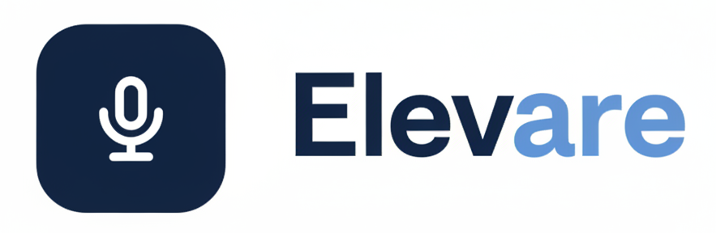

<div align="center">

<h1>
  
</h1>

### AI-Powered Public Speaking & Soft Skills Coach

*Master your delivery. Master your material. Master the room.*

[](https://www.python.org/)
[](https://pytorch.org/)
[](https://www.tensorflow.org/)
[]()

**[🎥 Watch the Demo](#-demo)** • **[📄 Full Documentation](#-documentation)** • **[🚀 Getting Started](#-getting-started)**

</div>

---

## 📖 Overview

**Elevare** is an advanced, AI-powered multimodal public speaking coach that unifies **emotion recognition**, **presentation analysis**, **dynamic question generation**, **answer validation**, and **feedback synthesis** into a single, cohesive platform.

Nearly 50% of students report high levels of public speaking anxiety, and professionals routinely lose opportunities not due to a lack of expertise, but due to ineffective delivery. Existing tools tackle this problem in isolated pieces — pace tracking *or* filler-word detection *or* generic quiz questions. Elevare brings these together into one **content-aware training experience** that reacts to *your* material, *your* delivery, and *your* weaknesses.

Built as a graduation project at **Ain Shams University — Faculty of Computer & Information Sciences**.

## 🎥 Demo

> _Add your demo video link/embed here_
>
> `[](YOUR_VIDEO_LINK_HERE)`

## ✨ Key Features

| Capability | Description |
|---|---|
| 🗣️ **Multimodal Emotion Recognition** | Fuses speech, facial expression, and body language analysis into one unified delivery score |
| 📊 **Objective + Empathetic Feedback** | Dual-Agent architecture separates cold analytical scoring from warm, human-like coaching |
| 📑 **Content-Aware Q&A** | Uploads your slides and generates real, context-grounded practice questions — not generic templates |
| 🧠 **Cognitive-Level Targeting** | Questions rephrased across all six levels of Bloom's Taxonomy (Remember → Create) |
| ✅ **Automated Answer Grading** | Zero-shot LLM scoring with detailed, actionable feedback on every response |
| 👁️ **Eye Contact & Gaze Tracking** | Lightweight geometric gaze estimation, no heavy gaze-specific model required |

## 🧩 Core Modules & Performance

| Module | Approach | Result |
|---|---|---|
| **Speech Emotion Recognition** | Stacked Bi-LSTM over 190 acoustic features (MFCCs, Chroma, Log-Mel, etc.), PCA-reduced | **92.9%** accuracy |
| **Facial Emotion Recognition** | GiMeFive CNN (5 conv blocks, ~10.5M params) on RAF-DB | **84.46%** accuracy |
| **Body Language Recognition** | Temporal CNN over multi-scale joint/bone/velocity streams (MEED dataset) | **89.5%** accuracy |
| **Question Generation** | Semantic Graph Conversational QG (SG-CQG) + Bloom's Taxonomy persona rephrasing via Llama 3.3-70B | High anchor grounding (~97–99%) |
| **Answer Validation** | Zero-shot ASAS-F-Z via DSPy Chain-of-Thought + Llama 3.3-70B | **72.48%** grading accuracy |
| **Feedback Generation** | Dual-Agent (Gemini 2.5 Flash): Reasoning Agent + Coaching Agent, Sandwich + OIS method | Structured, bias-controlled reports |

## 🛠️ Tech Stack

**Machine Learning / AI**
- PyTorch, TensorFlow/Keras — deep learning models (BiLSTM, CNN, ConvNeXt, Temporal CNN)
- DSPy — declarative prompt orchestration for LLM evaluation
- Llama 3.3-70B (via Groq API), Gemini 2.5 Flash — LLM-driven generation & reasoning
- faster-whisper — speech-to-text transcription
- MediaPipe, OpenCV — facial landmark & gaze tracking
- Librosa — audio feature extraction
- Tesseract OCR — slide text extraction

**Application**
- `client/` — frontend application
- `server/` — backend API & AI pipeline orchestration

## 📂 Repository Structure

```
Main/
├── client/          # Frontend application
├── server/          # Backend services, AI pipeline, models
├── .gitattributes   # Git LFS config for model weights
├── .gitignore
└── README.md
```

## 🚀 Getting Started

### Prerequisites
- Python 3.10+
- Node.js (for the client)
- Git LFS (large model files are tracked via LFS)

### Installation

```bash
# Clone the repository
git clone https://github.com/GP-Elevare/Main.git
cd Elevare

# Pull LFS-tracked model files
git lfs pull

# Backend setup
cd server
npm install

# Frontend setup
cd ../client
npm install
```

### Running the app

```bash
# Start the backend
cd server
node index.js  

# Start the frontend
cd client
npm run dev
```

## 👥 Team

Developed by students of the Computer Science Department, Faculty of Computer & Information Sciences, Ain Shams University:

- Nouran Haitham Othman
- Malak Khaled Mohammed
- Malek Ahmed Mohamed
- Mohammed Wael Marwan
- Mohammed Akram Mohammed
- Abd-Rhman Osama Mohammed

**Under the supervision of:**
- Dr. Hanan Hindy — Lecturer, Computer Science Department
- TA. Radwa Reda Hossieny — Assistant Lecturer, Scientific Computing Department

## 📄 Documentation

The full graduation project documentation — covering related work, system design, implementation details, and experimental results — is available in [`/docs`](./docs).

## 🔮 Future Work

- 🎓 Real-world academic integration and pilot testing with university seminars
- 🌍 Multilingual support (starting with Arabic)
- 🧑‍🤝‍🧑 Immersive audience simulation via reactive virtual avatars

---

<div align="center">
Made with 🎤 by the Elevare team — Cairo, 2025/2026
</div>
